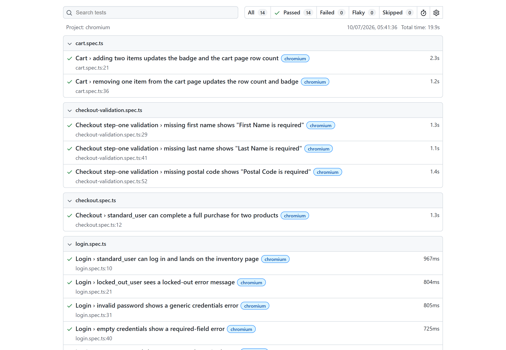
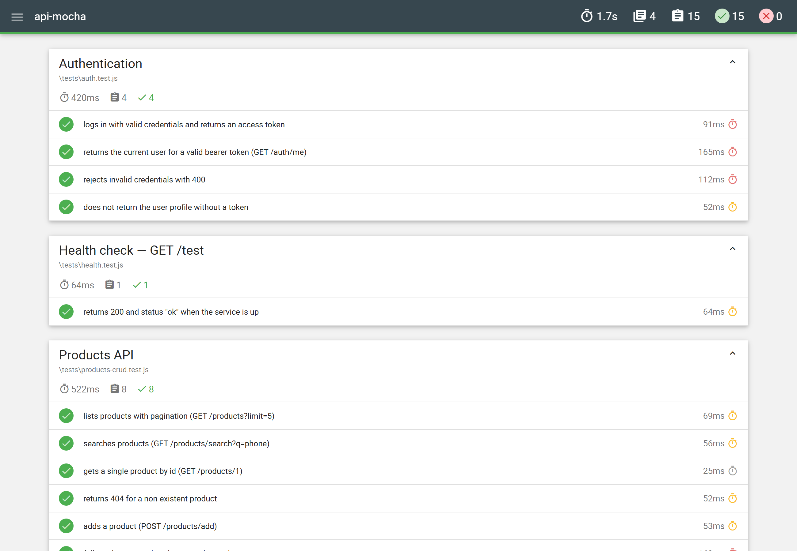
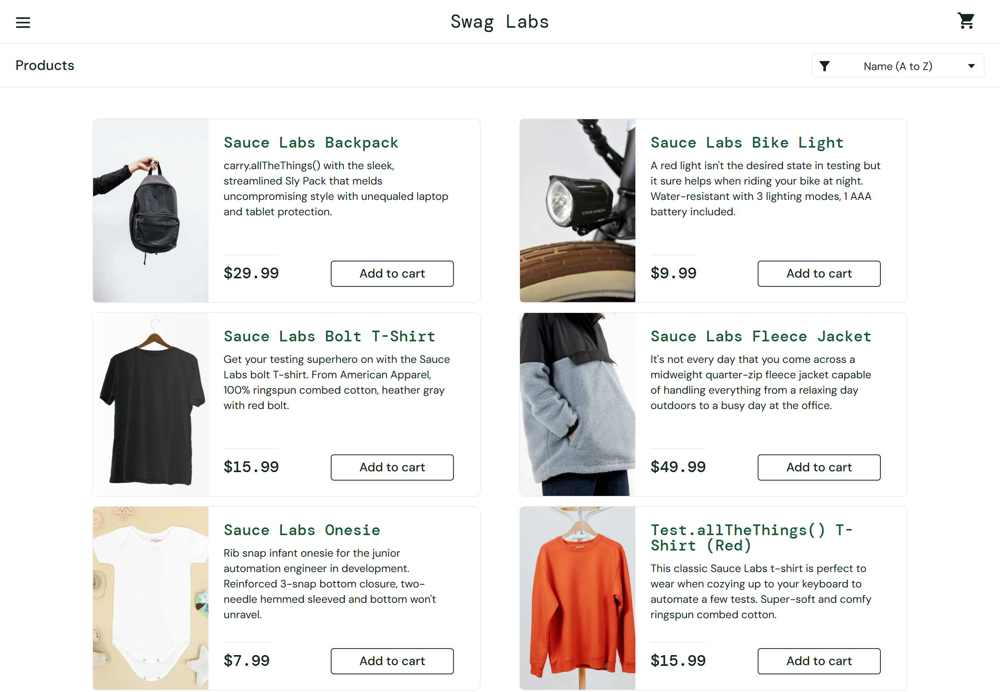

# QA Portfolio — Ivan Andrijko

**Senior QA Engineer · E-commerce · Manual + AI-Assisted Automation**

[](https://github.com/nihes/qa-portfolio/actions/workflows/ci.yml)


> **Senior QA Engineer**, **4+ years** testing high-traffic **e-commerce**. In my day job
> I test a **20+ market, multistore Magento 2** platform (plus Salesforce Commerce);
> this repo applies that same production rigor to **public demo apps** so anyone can
> clone, run and verify it. **C2 English**, fully **remote**.
> **[LinkedIn](https://linkedin.com/in/ivanandrijko)** · **[GitHub](https://github.com/nihes)** · [How it's built →](./docs/architecture.md)

**At a glance:** 16 self-contained test suites · 12-job GitHub Actions pipeline (green) ·
6+ automation frameworks · manual + API (REST + GraphQL) + UI + BDD + mobile + performance
+ security + accessibility + email · 27 documented test cases · 4 filed bug reports ·
100% public, credential-free targets.

> 🧭 **New here? Start with** the **[`playwright/`](./playwright/)** suite (E2E with the
> Page Object Model), the **[`manual-testing/`](./manual-testing/)** docs (test strategy,
> RTM, risk-based testing, ISTQB techniques), and **[`docs/architecture.md`](./docs/architecture.md)**
> for the big picture.

---

## What this is

A hands-on QA portfolio covering the full testing stack end to end — from structured
**manual** artifacts (test plans, cases, bug reports, exploratory charters, RTM, risk
analysis) to **automated** coverage across **Playwright**, **Cypress**, **Selenium**,
**Cucumber (BDD)**, **Postman/Newman**, **Mocha** (REST + GraphQL), **mobile**
(emulation + Appium), **email**, **accessibility**, **performance (k6)** and **security**.

Everything runs against **public demo targets** so anyone can clone and execute it:

- **[SauceDemo](https://www.saucedemo.com/)** — UI flows (login → cart → checkout).
- **[DummyJSON](https://dummyjson.com/)** & **[Automation Exercise](https://automationexercise.com/)** — REST APIs.
- **[Countries GraphQL](https://countries.trevorblades.com/)** — GraphQL API.

> **On AI:** built pragmatically with AI-assisted tooling to maximise breadth and
> velocity — but every architectural and coverage decision (what's tested, what runs in
> CI, and why) is mine.

---

## Reports & proof

Real artifacts produced by the suites in this repo — from actual test runs, not mock-ups:

| Playwright HTML report | API tests — mochawesome | App under test — SauceDemo |
|:---:|:---:|:---:|
| [](./docs/images/playwright-report.png) | [](./docs/images/api-mocha-report.png) | [](./docs/images/saucedemo-app.png) |

Every push is verified by the [GitHub Actions pipeline](https://github.com/nihes/qa-portfolio/actions) (12 jobs, green).

---

## What's inside

### Manual QA
| Folder | Demonstrates | Stack |
|---|---|---|
| [`manual-testing/`](./manual-testing/) | Test plan, 27 test cases, 4 bug reports, exploratory charters, RTM, test strategy, risk-based testing, ISTQB test-design techniques, QA metrics | Markdown QA docs |

### API testing
| Folder | Demonstrates | Stack | Target |
|---|---|---|---|
| [`api-postman-newman/`](./api-postman-newman/) | Collection-based REST tests, positive + negative | Postman + Newman | automationexercise.com |
| [`api-mocha/`](./api-mocha/) | Code-based REST tests: JWT auth, pagination, search, full CRUD, **JSON-schema contract** validation | Mocha + Chai + axios + ajv | dummyjson.com |
| [`api-graphql/`](./api-graphql/) | GraphQL: queries, variables, null-vs-error handling, schema validation, nested queries | Mocha + Chai + axios | countries.trevorblades.com |

### UI end-to-end
| Folder | Demonstrates | Stack | Target |
|---|---|---|---|
| [`playwright/`](./playwright/) | E2E with Page Object Model | Playwright + TypeScript | saucedemo.com |
| [`cypress/`](./cypress/) | E2E with custom commands | Cypress + TypeScript | saucedemo.com |
| [`selenium-mocha/`](./selenium-mocha/) | E2E with the classic WebDriver stack | Selenium WebDriver + Mocha + Chai | saucedemo.com |

### BDD
| Folder | Demonstrates | Stack | Target |
|---|---|---|---|
| [`cucumber-bdd/`](./cucumber-bdd/) | Gherkin feature files driving a browser | Cucumber.js + Playwright | saucedemo.com |

### Mobile
| Folder | Demonstrates | Stack | Target |
|---|---|---|---|
| [`mobile-web-playwright/`](./mobile-web-playwright/) | Mobile device emulation (iPhone 13, Pixel 5) — viewport, UA, touch | Playwright devices | saucedemo.com |
| [`appium-mobile/`](./appium-mobile/) | Real-device / emulator + BrowserStack example *(not in CI)* | Appium + WebdriverIO | saucedemo.com |

### Specialised
| Folder | Demonstrates | Stack |
|---|---|---|
| [`email-testing/`](./email-testing/) | SMTP delivery assertions (Mailpit) + offline HTML-email validation | nodemailer + Mailpit + cheerio + Mocha |
| [`accessibility/`](./accessibility/) | Automated a11y scans (WCAG 2 A/AA), assert on critical violations | @axe-core/playwright |
| [`performance/`](./performance/) | Load test with p95-latency & error-rate thresholds *(run locally — needs the k6 binary)* | k6 |
| [`visual-regression/`](./visual-regression/) | Screenshot baseline diffing *(run locally — baselines are OS-specific)* | Playwright `toHaveScreenshot` |
| [`security/`](./security/) | Security-header audit + authentication/access-control checks; OWASP Top 10 reference | Mocha + Chai + axios |
| [`test-data/`](./test-data/) | Synthetic test-data factories, data-driven generation, deterministic seeding | @faker-js/faker + Mocha |

---

## Documentation

- [`docs/architecture.md`](./docs/architecture.md) — how the portfolio is organised, test targets, and the CI pipeline.
- [`docs/skills-matrix.md`](./docs/skills-matrix.md) — which QA skills & tools each suite demonstrates.
- [`docs/CONTRIBUTING.md`](./docs/CONTRIBUTING.md) — conventions and how to run any suite.
- [`docs/test-automation-patterns.md`](./docs/test-automation-patterns.md) — patterns & principles (POM/Screenplay, waiting strategies, flake control, reporting).
- [`docs/localization-testing.md`](./docs/localization-testing.md) — i18n/l10n testing for multi-market e-commerce.
- [`docs/ci-cd.md`](./docs/ci-cd.md) — the CI/CD pipeline, quality gates, and shift-left approach.

---

## Quick start

Each folder is a self-contained project with its own `README.md` and `package.json`.

```bash
# API — Newman (Postman collection)
cd api-postman-newman && npm install && npm test

# API — Mocha + axios (dummyjson)
cd api-mocha && npm install && npm test

# Playwright (UI)
cd playwright && npm install && npx playwright install chromium && npm test

# Cypress (UI)
cd cypress && npm install && npm test

# Selenium + Mocha (UI)   — needs Chrome installed
cd selenium-mocha && npm install && npm test

# Cucumber (BDD)
cd cucumber-bdd && npm install && npx playwright install chromium && npm test

# Mobile device emulation
cd mobile-web-playwright && npm install && npx playwright install chromium webkit && npm test

# Accessibility
cd accessibility && npm install && npx playwright install chromium && npm test

# Email — offline HTML validation (no services needed)
cd email-testing && npm install && npm run test:html
# ...full email suite (needs Mailpit):  docker run -d -p 1025:1025 -p 8025:8025 axllent/mailpit && npm test
```

The `manual-testing/` folder needs no tooling — just open the Markdown files.
`appium-mobile/` needs an Android emulator or BrowserStack credentials — see its README.

---

## Skills demonstrated

- **Manual QA:** test planning, test case design (functional / negative / boundary),
  session-based exploratory testing, clear reproducible bug reporting.
- **UI automation:** Playwright, Cypress and Selenium — Page Object Model, custom
  commands, web-first assertions, explicit waits, no arbitrary sleeps.
- **API testing:** both collection-based (Postman/Newman) and code-based (Mocha +
  axios) — auth/JWT, pagination, search, full CRUD, positive + negative cases.
- **BDD:** Gherkin feature files with a clean step-definition layer.
- **Mobile:** device emulation (viewport, UA, touch) plus a real-device/BrowserStack
  Appium example.
- **Email QA:** SMTP delivery assertions against a capture server, plus offline
  HTML-email structure validation (links, alt text, preheader, DOCTYPE).
- **Accessibility:** automated WCAG scanning with axe-core.
- **CI:** every runnable suite runs in GitHub Actions — see [`.github/workflows/ci.yml`](./.github/workflows/ci.yml).
- **E-commerce domain:** cart, checkout, coupons, totals, payment failure, orders,
  product search / filter / sort, account & auth.

---

## About & contact

**Ivan Andrijko** — Senior QA Engineer · e-commerce (Magento 2 & Salesforce Commerce) ·
4+ years · C2 English · fully remote.
[LinkedIn](https://linkedin.com/in/ivanandrijko) · [GitHub](https://github.com/nihes)

Licensed under the [MIT License](./LICENSE).
